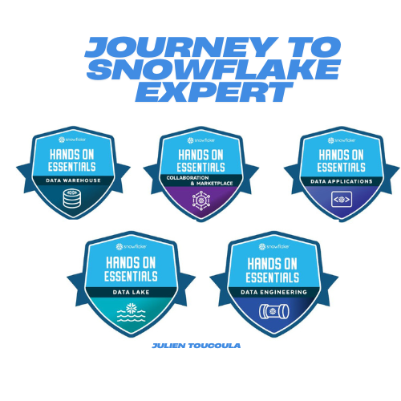

# ❄️ JourneyToSnowflakeExpert ❄️

  

 

## Welcome to my JourneyToSnowflakeExpert repo!
 

🎯 My goal is to complete over 100 hours of Snowflake learning and practice in order to become an expert.

 

### 🎖 Badge 1: Data Warehousing Workshop ✅
[View your Badge](./Badge%201/Badge%201.pdf)

The Data Warehousing workshop is designed for learners who are new to Snowflake or databases in general. 
Through interactive labs, short videos and a fun scenario, you'll learn the basics: account setup, roles, data loading and semi-structured data processing.

---

### 🎖 Badge 2: Sharing, Marketplace, & Exchanges Workshop (in progress)

A course covering Snowflake's revolutionary data sharing technologies. Learn to create and administer direct shares, shop for data sets on the Data Marketplace, and create and manage exchange data listings. Understand how your organization can get rid of nightly extracts and cumbersome ETL processes and possibly monetize your organization's data. 

---

### 🎖 Badge 3: Data Application Builders Workshop

This course covers a wide array of technologies to help build applications that use Snowflake as a back end. Including: Streamlit (Python), SnowSQL, REST APIs, and much more. 

---

### 🎖 Badge 4: Data Lake Workshop

The Data Lake Workshop (DLKW) covers non-loaded data and the tools you can use in Snowflake to access and analyze that data. Learn about non-loaded data, unstructured data, GeoSpatial data, and hear about the Iceberg tables that are coming soon! Get hands on experience with Parquet and GeoJSON data, and image data. Run GeoSpatial Functions and create your own User Defined Function.

---

### 🎖 Badge 5: Data Engineering Workshop

The Data Engineering Workshop dives into building robust, scalable data pipelines within Snowflake. It focuses on advanced transformations, automation, and best practices for data engineering projects. This workshop is ideal for those looking to streamline their ETL/ELT processes and fully leverage Snowflake’s powerful features.